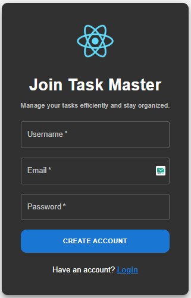
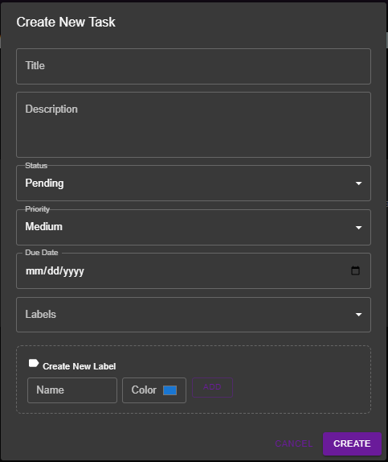
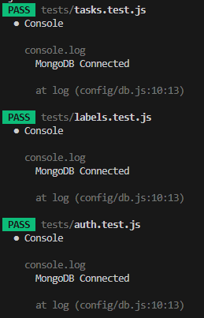
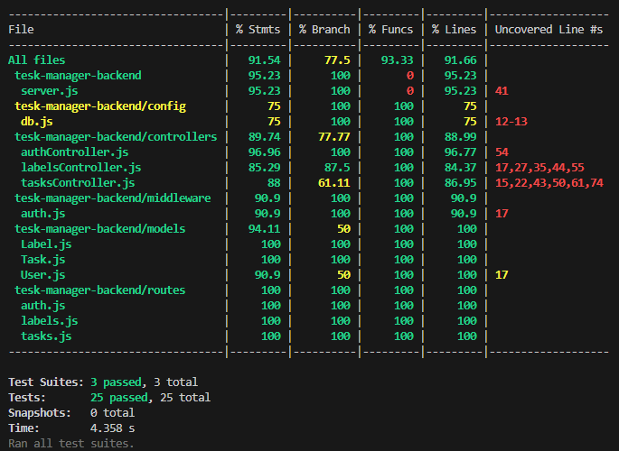
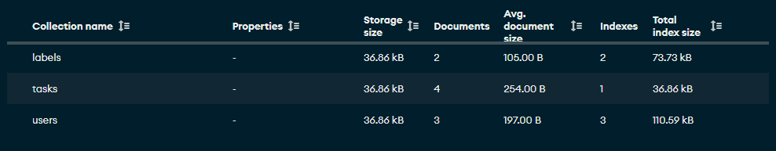
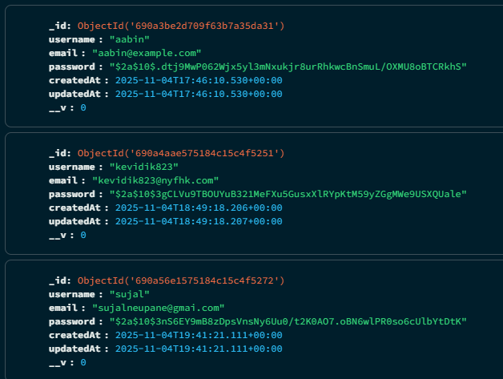
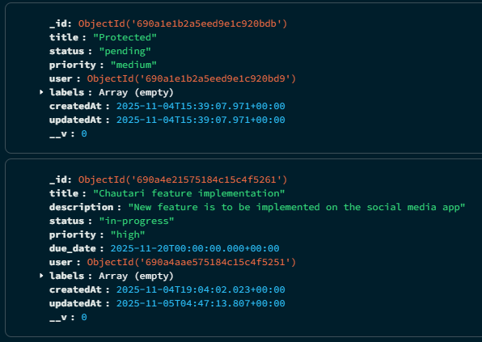
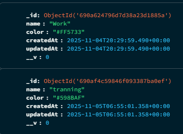

# 🖥️ Task Management System


A **full-stack task management application** that lets users signup, login, and manage tasks with full CRUD functionality, apply priority, due-date, labels. Built with **Node.js** & **express** on the backend and **React** on the frontend.

---

## 🌟 Features

- ✅ User Authentication (Register & Login) with JWT tokens
- ✅ Protected Routes for authenticated users
- ✅ Task Management (Create, Read, Update, Delete)
- ✅ MongoDB storage (Database is being used)
- ✅ Responsive UI with **React** and **CSS**
- ✅ Validation & Error Handling
- ✅ Full test coverage using **Jest**

---

## 📂 Project Structure

### Root

```

Task_Management/
├── backend/              # Express + MongoDB backend
├── frontend/             # React frontend
├── package.json          # Root config (concurrently, scripts)
└── README.md             # Project documentation

```

### Backend

```

backend/
├── config/
│   └── db.js                 # MongoDB connection
├── controllers/
│   ├── authController.js     # Auth logic
|   ├── labelsController.js   # Label logic
│   └── tasksController.js    # Task CRUD
├── middlewares/
│   └──  authMiddleware.js    # JWT auth check
├── models/
│   ├── Label.js              # Label schema
│   ├── Task.js               # Task schema
│   └── User.js               # User schema
├── public/
│   └── imagess               # All necessary images
├── routes/
│   ├── auth.js               # Auth endpoints
│   ├──labels.js              # Labels endpoints
│   └── tasks.js              # Task endpoints
├── tests/
│   ├── auth.test.js          # Auth test automation
│   ├──labels.test.js         # Labels test automation
│   └── tasks.test.js         # Task test automation
│
├── postman_collection.json   # Postman data collection
├── server.js                 # Server bootstrap
├── .env                      # Env config
└── package.json              # Backend dependencies

```

### Frontend

```

frontend/src/
├── components/
│   └── Header.jsx      # Header design and Icon
│
├── pages/
│   ├── Dashboard.js            # User dashboard (list Tasks, create Tasks)
│   ├── Login.js                # Login form
│   └── Register.js             # Registration form
│
├── App.jsx                     # Routing & layout
├── index.js                    # Logo, name and design Task Management app
├── index.css                   # Global Tailwind styles
├── App.css                     # Extra component styles if needed
├── reportWebVitals.js          # Performance monitoring
├── package.json                # Frontend dependencies and information
└── setupTests.js               # Jest setup


```

---

## 🚀 Installation

1. Clone the repository:

```bash
git clone https://github.com/Abi2947/Task_Management_System.git
cd Task_Management_System
```

2. Install all dependencies from root:

```bash
npm install
npm run intsall:all
```

3. Set environment variables in `backend/.env`:

```env
PORT=5000
MONGO_URI=mongodb://127.0.0.1:27017/task_management_db
JWT_SECRET=node -e "console.log(require('crypto').randomBytes(32).toString('hex'))"cd 
```

---

## 💻 Running the App

### Run both frontend and backend together

```bash
npm run dev
```

### Run backend only

```bash
cd backend
npm run dev
```

### Run frontend only

```bash
cd frontend
npm start
```

Access the app at: [http://localhost:3000](http://localhost:3000)

---

## 📜 Scripts

### From root

- `npm run install:all` – Installs backend + frontend dependencies
- `npm run dev:backend` - Runs the backend server.
- `npm run dev:frontend` - Run frontend server
- `npm run dev` – Runs both server concurrently.

### Backend

- `npm start` – Run production server
- `npm run dev` – Run dev server with nodemon
- `npm test` – Run API tests "While testing coment line 44 and 45 (i.e. post listen)"

### Frontend

- `npm start` – Run frontend dev server
- `npm run build` – Build frontend for production
- `npm test` – Run frontend tests

---

## 🛠 Technologies Used

- **Backend:** Node.js, Express, JWT, bcrypt, express-validator, Mangoose
- **Frontend:** React, CSS, React Router
- **Database:** MangoDB
- **Testing:** Jest, supertest
- **Storage:** Mangodb JSON files format (database storage)
- **Tools:** Concurrently for running full-stack

---

## ✨ Contributing

1. Fork the repository
2. Create a new branch (`git checkout -b feature-name`)
3. Make your changes
4. Commit your changes (`git commit -m 'Add feature'`)
5. Push to the branch (`git push origin feature-name`)
6. Open a Pull Request

---

## 📄 License

This project is licensed under the **MIT License**.

---

## 👨‍💻 Author

**Utsab Gautam** – Full-Stack Developer

---

## 📸 Screenshots












## ☕ Support Me

If you like my work, you can [buy me a coffee](https://www.buymeacoffee.com/yourusername)!

[](https://www.buymeacoffee.com/yourusername)
